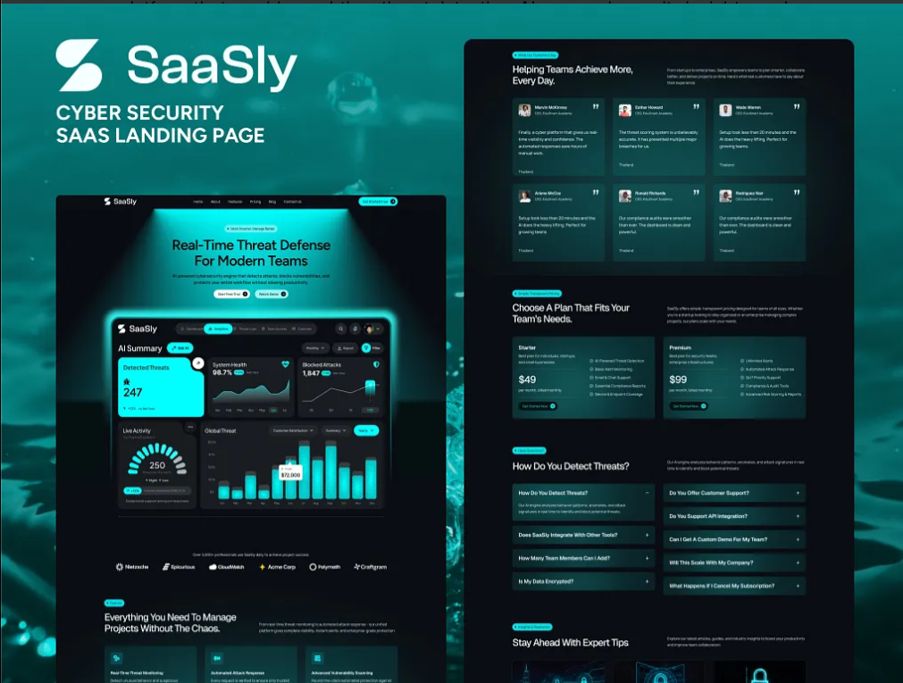
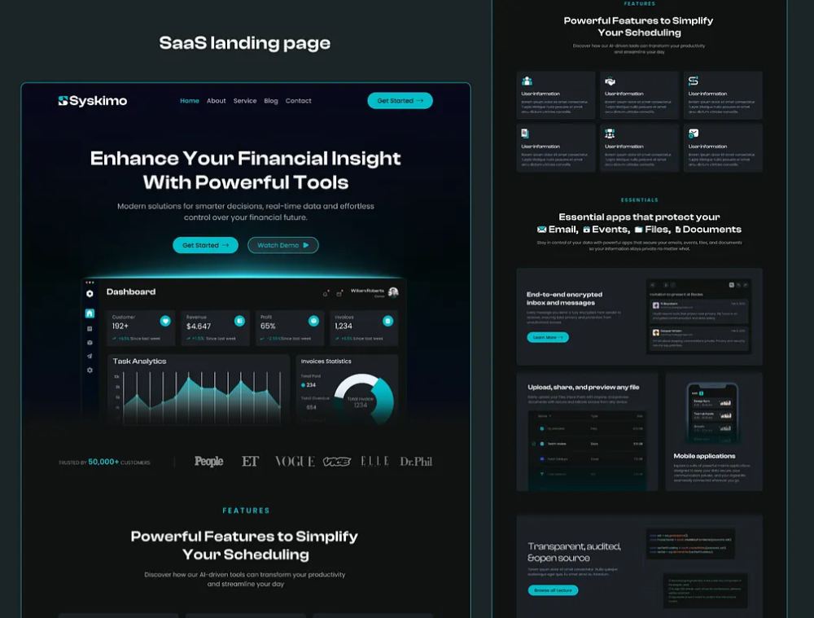

# Design Inspiration for the website 
Purpose: Establish the overall aesthetic that ties everything together.

### Aesthetic keywords
- dark, premium, technical, minimal 

## Inspiration 1 

Main Color to use 
- I like the dark theme as overall background
- I like the #01FFFF color for my main color 

## Inspiration 2

Background
- I like the Dark elegant background with the subtle noise and glowing particles

Typography
- I like the combination of Clean + calligraphic contrast 
- Fonts to use: Satoshi + Instrument serif Regular Italic 

Colors
- I like to use an orange color #ffa260 as the complementary accent to the main #01FFFF only for glow, highlights, and subtle accents, not for text.
