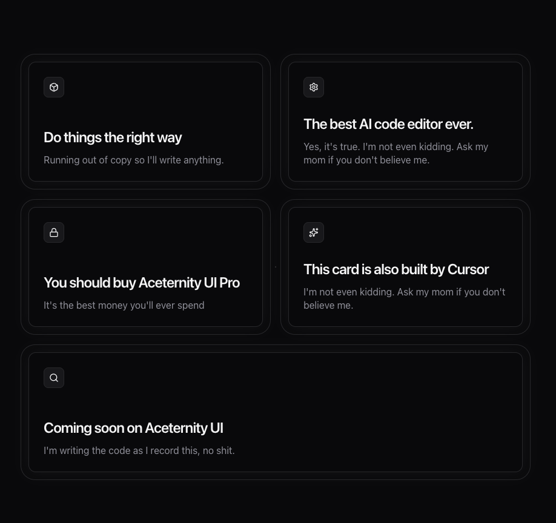
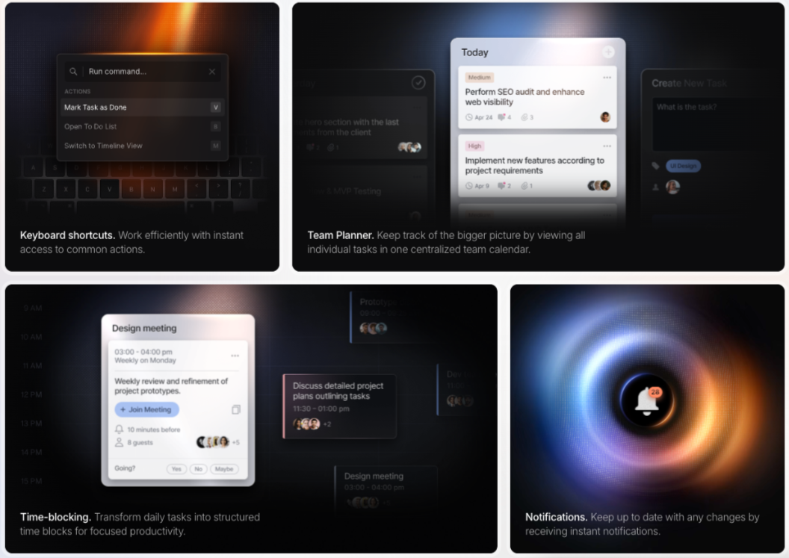

# Features Section

## Content

**Tag:** Platform Features  
**Title:** Security  
**Subtitle (accent):** Orchestration.  
**Description:** Connect every element of your security posture to build a dynamic defense system.  
Guardian AI acts as the second brain for your SOC team.

## Feature Cards

---

### **1. Audit Ready**
**Subtext:** Automated checks.  
**Items:**  
- SOC2 Type II  
- GDPR Data Map  
- ISO 27001  

---

### **2. Incident Timeline**
**Subtext:** Visualize attack vectors.  
**Items:**  
**BREACH ATTEMPT**  
02:14:23 AM — SQL Injection  
**MITIGATED**  
02:14:44 AM — IP Blocked  

---

### **3. Threat Score**
**Subtext:** Real-time risk assessment.  
**Score Display:** **98 — SECURE**

---

### **4. AI Analyst**
**Subtext:** Chat with your logs.  
**Chat Bubbles:**  
- "Analyze the latency spike on port 443."  
- "Detected DDOS signature from botnet #82. Mitigating…"  
**Input Field:** "Type a message…"

---

### **5. Security Logs**
**Subtext:** Immutable audit trails.  
**Log Items:**  
- AUTH_Service started  
- WARN — Latency > 200ms  
- PASS — Health Check OK  
- USER_LOGIN — Logged In  
- FAIL — Connection Reset  
- CRIT — Database Locked  

---

### **6. Live Sessions**
**Subtext:** Monitor active users and automated agents in real-time.  
**Status:** 3 active sessions  
**User List:**  
- Sarah Chen — San Francisco, US — Chrome macOS — Now  
- Alex Rivera — Austin, US — Firefox Windows — 2m ago  
- James Wilson — London, UK — Safari iOS — 15m ago  
**Footer Link:** View all sessions →

---

### **7. Patch Management**
**Subtext:** Zero-downtime updates.  
**Item:**  
**CVE-2023-4421 — Pending**  
OpenSSL High Severity Vulnerability in auth module.  
**Button:** Deploy Patch  

## Component and Design Instruction 

- Bento card style, assymetric
- Card structure and shape should be like this component, also use the  hover effect use this glow effect around the cards:  
- Use this component: 

 

"use client";

import { memo, useCallback, useEffect, useRef } from "react";
import { cn } from "@/lib/utils";
import { animate } from "motion/react";

interface GlowingEffectProps {
  blur?: number;
  inactiveZone?: number;
  proximity?: number;
  spread?: number;
  variant?: "default" | "white";
  glow?: boolean;
  className?: string;
  disabled?: boolean;
  movementDuration?: number;
  borderWidth?: number;
}
const GlowingEffect = memo(
  ({
    blur = 0,
    inactiveZone = 0.7,
    proximity = 0,
    spread = 20,
    variant = "default",
    glow = false,
    className,
    movementDuration = 2,
    borderWidth = 1,
    disabled = true,
  }: GlowingEffectProps) => {
    const containerRef = useRef<HTMLDivElement>(null);
    const lastPosition = useRef({ x: 0, y: 0 });
    const animationFrameRef = useRef<number>(0);

    const handleMove = useCallback(
      (e?: MouseEvent | { x: number; y: number }) => {
        if (!containerRef.current) return;

        if (animationFrameRef.current) {
          cancelAnimationFrame(animationFrameRef.current);
        }

        animationFrameRef.current = requestAnimationFrame(() => {
          const element = containerRef.current;
          if (!element) return;

          const { left, top, width, height } = element.getBoundingClientRect();
          const mouseX = e?.x ?? lastPosition.current.x;
          const mouseY = e?.y ?? lastPosition.current.y;

          if (e) {
            lastPosition.current = { x: mouseX, y: mouseY };
          }

          const center = [left + width * 0.5, top + height * 0.5];
          const distanceFromCenter = Math.hypot(
            mouseX - center[0],
            mouseY - center[1]
          );
          const inactiveRadius = 0.5 * Math.min(width, height) * inactiveZone;

          if (distanceFromCenter < inactiveRadius) {
            element.style.setProperty("--active", "0");
            return;
          }

          const isActive =
            mouseX > left - proximity &&
            mouseX < left + width + proximity &&
            mouseY > top - proximity &&
            mouseY < top + height + proximity;

          element.style.setProperty("--active", isActive ? "1" : "0");

          if (!isActive) return;

          const currentAngle =
            parseFloat(element.style.getPropertyValue("--start")) || 0;
          let targetAngle =
            (180 * Math.atan2(mouseY - center[1], mouseX - center[0])) /
              Math.PI +
            90;

          const angleDiff = ((targetAngle - currentAngle + 180) % 360) - 180;
          const newAngle = currentAngle + angleDiff;

          animate(currentAngle, newAngle, {
            duration: movementDuration,
            ease: [0.16, 1, 0.3, 1],
            onUpdate: (value) => {
              element.style.setProperty("--start", String(value));
            },
          });
        });
      },
      [inactiveZone, proximity, movementDuration]
    );

    useEffect(() => {
      if (disabled) return;

      const handleScroll = () => handleMove();
      const handlePointerMove = (e: PointerEvent) => handleMove(e);

      window.addEventListener("scroll", handleScroll, { passive: true });
      document.body.addEventListener("pointermove", handlePointerMove, {
        passive: true,
      });

      return () => {
        if (animationFrameRef.current) {
          cancelAnimationFrame(animationFrameRef.current);
        }
        window.removeEventListener("scroll", handleScroll);
        document.body.removeEventListener("pointermove", handlePointerMove);
      };
    }, [handleMove, disabled]);

    return (
      <>
        

        
 0 && "blur-[var(--blur)] ",
            className,
            disabled && "!hidden"
          )}
        >
          

        

      </>
    );
  }
);

GlowingEffect.displayName = "GlowingEffect";

export { GlowingEffect };

- Inside every feature card, generate a unique mini UI mock that represent the contentfor each card.  
 
